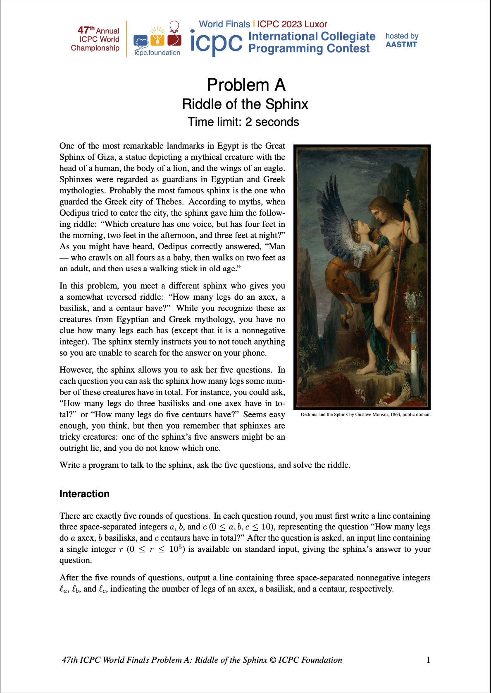
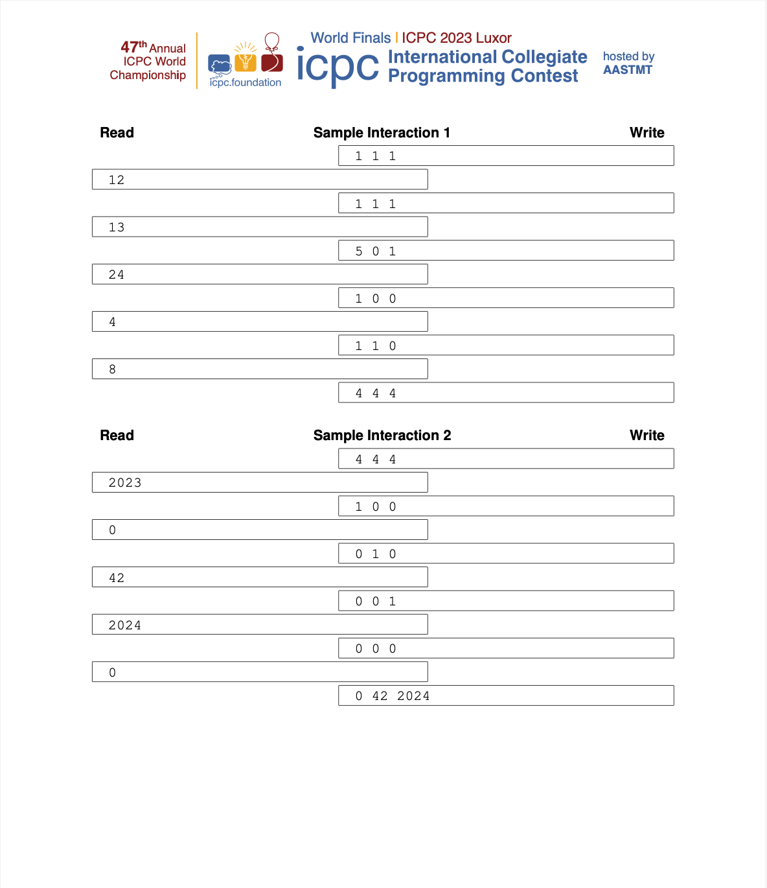
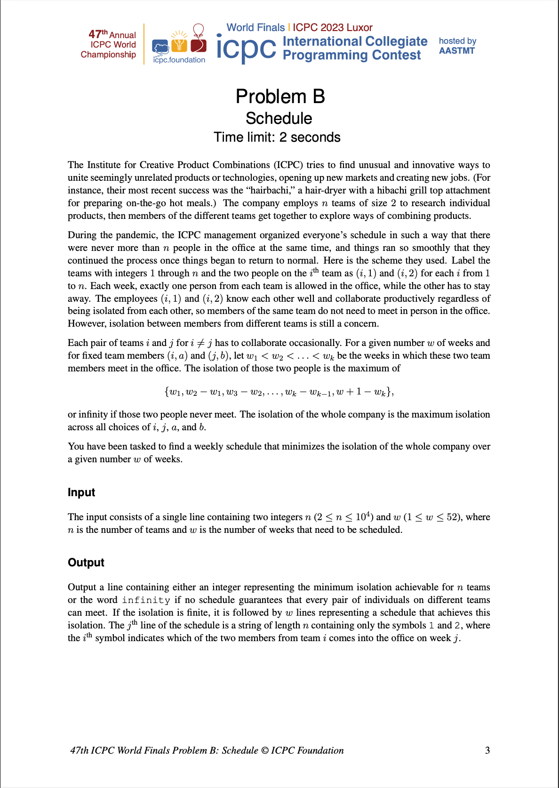
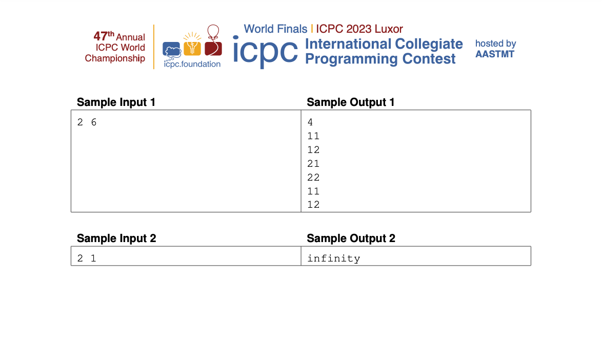
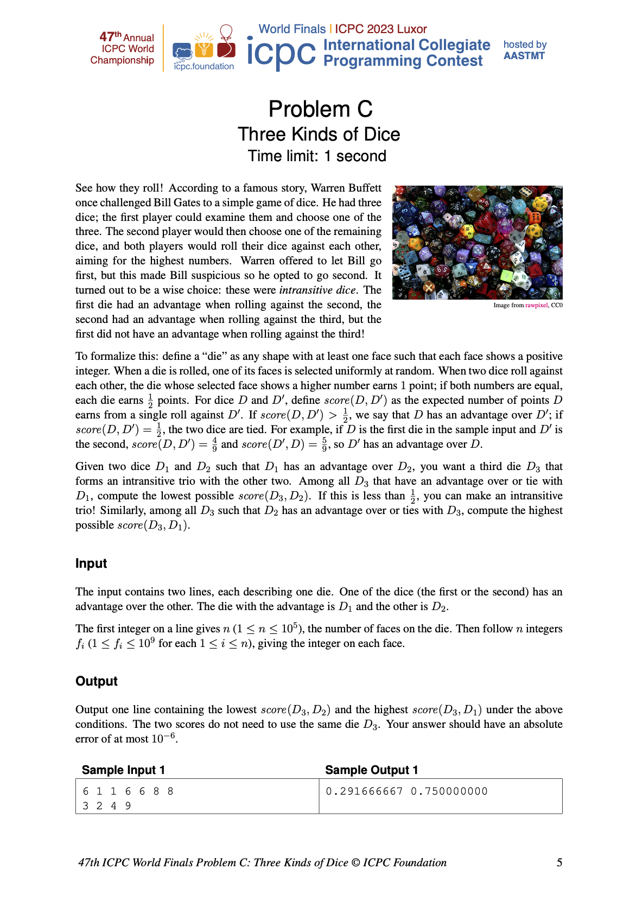
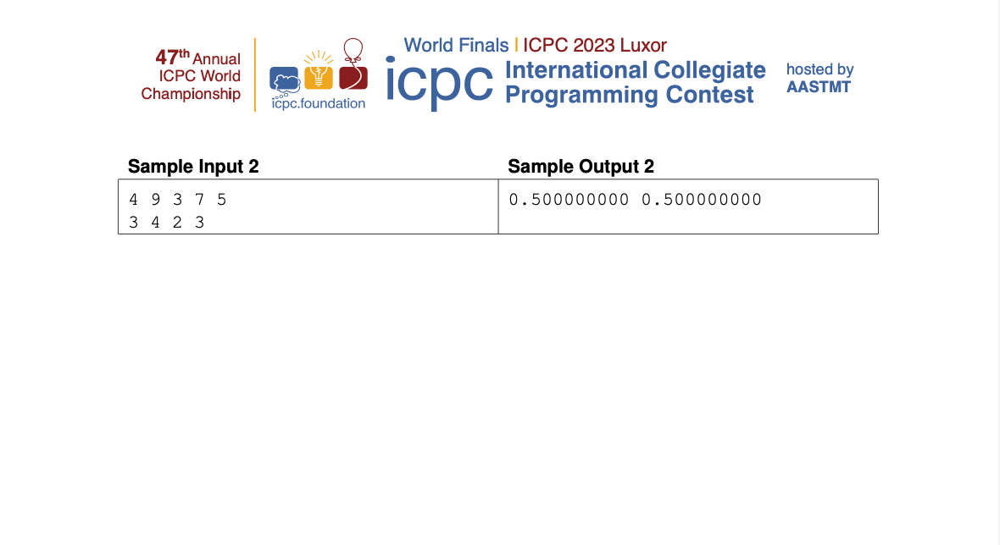
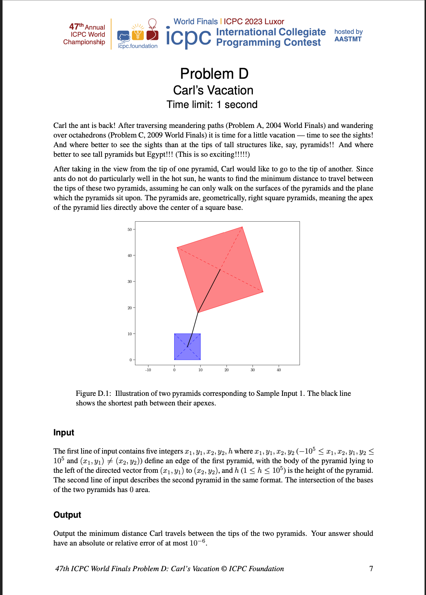
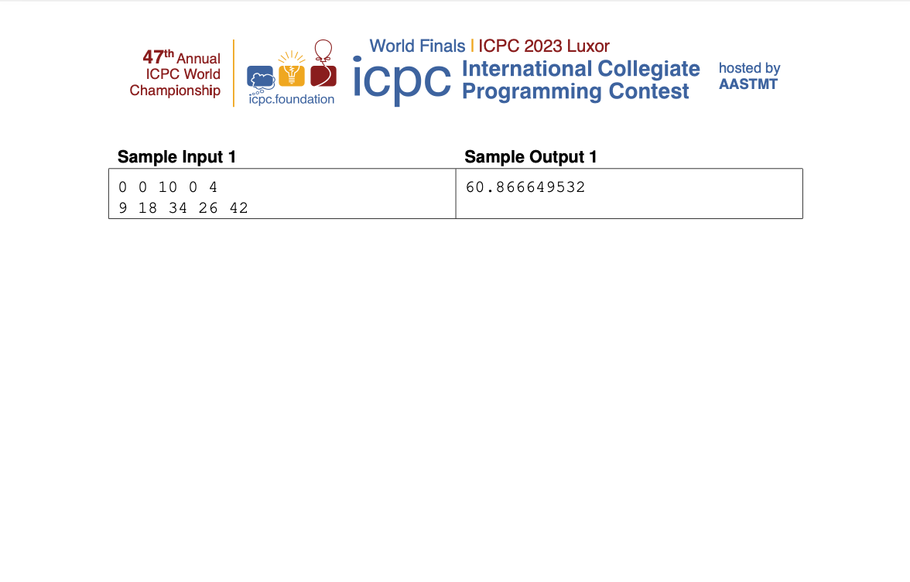
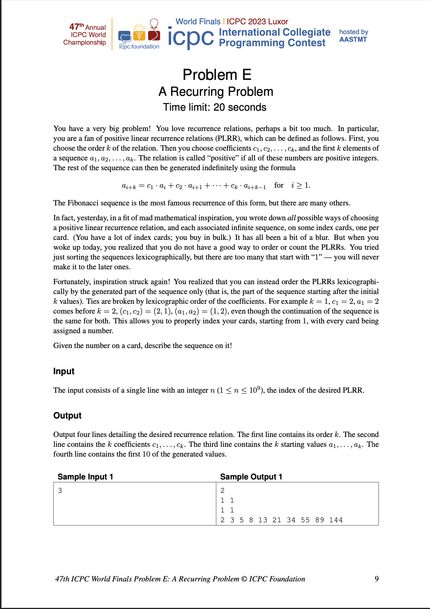
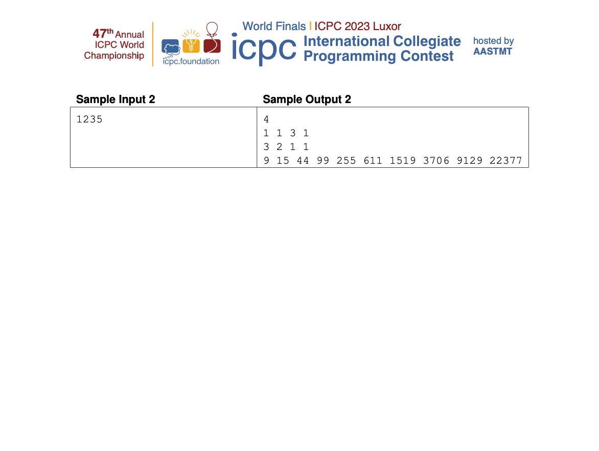

# 47th ICPC World Final 2023

## Problem A : Riddle of the Sphinx



### Solution

```cpp
#include <iostream>
using namespace std;

int main()
{
  int a, b, c, d, e;
  cout << "1 0 0" << endl;
  cin >> a;
  cout << "0 1 0" << endl;
  cin >> b;
  cout << "0 0 1" << endl;
  cin >> c;
  cout << "1 1 1" << endl;
  cin >> d;
  cout << "1 2 3" << endl;
  cin >> e;
  if (a + b + c == d)
    cout << a << ' ' << b << ' ' << c << endl;
  else if (a + 2 * b + 3 * c == e)
    cout << a << ' ' << b << ' ' << c << endl;
  else if ((d - b - c) + 2 * b + 3 * c == e)
    cout << d - b - c << ' ' << b << ' ' << c << endl;
  else if (a + 2 * (d - c - a) + 3 * c == e)
    cout << a << ' ' << d - c - a << ' ' << c << endl;
  else
    cout << a << ' ' << b << ' ' << d - a - b << endl;
}

```

## Problem B : Schedule



### Solution

```cpp
#include <algorithm>
#include <iostream>
#include <vector>
using namespace std;

int main() {
  int N, W;
  while (cin >> N >> W) {
    int c;
    vector<vector<int>> sch;
    for (c = 4; c <= W; c++) {
      sch.clear();
      vector<int> cur(c, 1);
      for (int i = c/2; i < c; i++) cur[i] = 2;
      do {
        sch.push_back(cur);
        next_permutation(cur.begin(), cur.end());
      } while (cur[0] == 1);
      if (sch.size() >= N) break;
    }
    if (c > W) { cout << "infinity" << endl; continue; }
    cout << c << endl;
    for (int i = 0; i < W; i++) {
      for (int j = 0; j < N; j++) cout << sch[j][i%c];
      cout << endl;
    }
  }
}

```
## Problem C : Three Kinds of Dice



### Solution :
```cpp
#include <algorithm>
#include <cassert>
#include <iomanip>
#include <iostream>
#include <vector>
using namespace std;

int main() {
  int64_t N1, N2;
  while (cin >> N1) {
    vector<int> D1(N1);
    for (auto& x : D1) cin >> x;
    cin >> N2;
    vector<int> D2(N2);
    for (auto& x : D2) cin >> x;
    sort(D1.begin(), D1.end());
    sort(D2.begin(), D2.end());
    D1.push_back(2e9);
    D2.push_back(2e9);

    // Ensure D1 beats D2.
    int64_t prob = 0;
    for (int i1 = 0, i2 = 0, j2 = 0; i1 < N1; i1++) {
      while (D2[i2] < D1[i1]) i2++;
      while (D2[j2] <= D1[i1]) j2++;
      prob += 2*i2 + (j2-i2);
    }
    //cerr << "D1 beats D2 prob: " << prob/2.0/N1/N2 << endl;
    assert(prob != N1*N2);
    if (prob < N1*N2) { swap(N1, N2); swap(D1, D2); }

    vector<int> poss;
    for (auto x : D1) { if (x > 1) poss.push_back(x-1); poss.push_back(x); poss.push_back(x+1); }
    for (auto x : D2) { if (x > 1) poss.push_back(x-1); poss.push_back(x); poss.push_back(x+1); }
    sort(poss.begin(), poss.end());
    poss.erase(unique(poss.begin(), poss.end()), poss.end());
    while (poss.back() > 1.5e9) poss.pop_back();
    vector<pair<double, double>> v;
    for (int pi = 0, i1 = 0, i2 = 0, j1 = 0, j2 = 0; pi < poss.size(); pi++) {
      while (D1[i1] < poss[pi]) i1++;
      while (D2[i2] < poss[pi]) i2++;
      while (D1[j1] <= poss[pi]) j1++;
      while (D2[j2] <= poss[pi]) j2++;
      v.emplace_back((2*i1+(j1-i1)) / 2.0 / N1,
                     (2*i2+(j2-i2)) / 2.0 / N2);
    }

    for (int rep = 0; rep < 2; rep++) {
      vector<int> hull;
      for (int i = 0; i < v.size(); i++) {
        while (hull.size() >= 2) {
          auto [x1, y1] = v[hull[hull.size()-2]];
          auto [x2, y2] = v[hull[hull.size()-1]];
          auto [x3, y3] = v[i];
          if ((x3-x1)*(y2-y1) < (x2-x1)*(y3-y1)) break;
          hull.pop_back();
        }
        hull.push_back(i);
      }

      double ret = 1.0;
      for (int i = 0; i+1 < hull.size(); i++) {
        auto [x1, y1] = v[hull[i]];
        auto [x2, y2] = v[hull[i+1]];
        if (x1 >= 0.5 || x2 < 0.5) continue;
        ret = y1 + (y2-y1)/(x2-x1)*(0.5-x1);
      }
      if (!rep) cout << fixed << setprecision(9) << ret << ' '; else cout << 1-ret << endl;

      for (auto& [v1, v2] : v) { swap(v1, v2); v1 = 1-v1; v2 = 1-v2; }
      reverse(v.begin(), v.end());
      reverse(poss.begin(), poss.end());
    }
  }
}

```
## Problem D : Carl's Vacation



### Solution :

```cpp
#include <algorithm>
#include <cmath>
#include <iomanip>
#include <iostream>
using namespace std;

struct Point {
  double x, y;
  Point operator+(const Point& p) const { return Point{x+p.x, y+p.y}; }
  Point operator-(const Point& p) const { return Point{x-p.x, y-p.y}; }
  Point operator*(double c) const { return Point{c*x, c*y}; }
  double len() const { return hypot(x, y); }
};

// Positive if b points counterclockwise of a.
inline double CrossProd(const Point& a, const Point& b) {
  return a.x*b.y - a.y*b.x;
}

bool Intersect(const Point& a1, const Point& a2, const Point& b1, const Point& b2) {
  double cp1 = CrossProd(a2-a1, b1-a1);
  double cp2 = CrossProd(a2-a1, b2-a1);
  if (cp1 < -1e-9 && cp2 < -1e-9) return false;
  if (cp1 >  1e-9 && cp2 >  1e-9) return false;
  cp1 = CrossProd(b2-b1, a1-b1);
  cp2 = CrossProd(b2-b1, a2-b1);
  if (cp1 < -1e-9 && cp2 < -1e-9) return false;
  if (cp1 >  1e-9 && cp2 >  1e-9) return false;
  return true;
}

int main() {
  Point a1, a2, b1, b2;
  double ah, bh;
  while (cin >> a1.x >> a1.y >> a2.x >> a2.y >> ah >> b1.x >> b1.y >> b2.x >> b2.y >> bh) {
    double aSideLen = (a2-a1).len();
    double bSideLen = (b2-b1).len();
    double aDiagLen = sqrt(aSideLen*aSideLen/2 + ah*ah);
    double bDiagLen = sqrt(bSideLen*bSideLen/2 + bh*bh);
    double aAltLen = sqrt(aSideLen*aSideLen/4 + ah*ah);
    double bAltLen = sqrt(bSideLen*bSideLen/4 + bh*bh);
    double ret = 1e9;
    for (int ai = 0; ai < 4; ai++) {
      Point ap{a1.y-a2.y, a2.x-a1.x};
      Point amid{(a1+a2)*0.5 + ap*0.5};
      for (int bi = 0; bi < 4; bi++) {
        Point bp{b1.y-b2.y, b2.x-b1.x};
        Point bmid{(b1+b2)*0.5 + bp*0.5};

        for (int aDiag = 0; aDiag < 2; aDiag++) {
          Point at = aDiag ? a1 : (a1+a2)*0.5 + ap*(aAltLen/aSideLen);
          double alen = aDiag ? aDiagLen : 0.0;
          for (int bDiag = 0; bDiag < 2; bDiag++) {
            Point bt = bDiag ? b1 : (b1+b2)*0.5 + bp*(bAltLen/bSideLen);
            double blen = bDiag ? bDiagLen : 0.0;
            if (!aDiag && (CrossProd(bmid-a1, a2-a1) < 0 || !Intersect(a1, a2, at, bt))) continue;
            if (!bDiag && (CrossProd(amid-b1, b2-b1) < 0 || !Intersect(b1, b2, at, bt))) continue;
            ret = min(ret, alen + blen + (bt-at).len());
          }
        }

        b1 = b2+bp; swap(b1, b2);
      }
      a1 = a2+ap; swap(a1, a2);
    }
    cout << fixed << setprecision(9) << ret << endl;
  }
}
```
## Problem E : A Recurring Problem



### Solution :

```cpp
#include <algorithm>
#include <cstring>
#include <iostream>
#include <map>
#include <vector>
using namespace std;

int64_t memo1[51];
int64_t count1(int64_t n) {
  if (n == 0) return 1;
  int64_t& ret = memo1[n];
  if (ret) return ret;
  for (int64_t a = 1; a <= n; a++)
  for (int64_t c = 1; a*c <= n; c++) {
    ret += count1(n - a*c);
  }
  return ret;
}

// Returns # of possible next elements for generated sequences matching "seq".
map<pair<vector<int64_t>, vector<int64_t>>, map<int64_t,int64_t>> memo;
vector<int64_t> curc, cura;
vector<tuple<vector<int64_t>, vector<int64_t>, vector<int64_t>>> saved;
const map<int64_t,int64_t>& count(vector<int64_t> seq, vector<int64_t> prev, bool save) {
  static map<int64_t,int64_t> empty{}, base{{0,1}};
  if (seq[0] == 0) {
    for (int i = 1; i < seq.size(); i++) if (seq[i]) return empty;
    if (save) {
      vector<int64_t> curs = cura;
      while (curs.size() < curc.size()+30) {
        int64_t x = 0;  // There may be some overflow, but this shouldn't affect relative sorting.
        for (int i = 0; i < curc.size(); i++) x += curs[curs.size()-curc.size()+i] * curc[i];
        curs.push_back(x);
      }
      curs.erase(curs.begin(), curs.begin()+curc.size());
      saved.push_back({curs, curc, cura});
    }
    return base;
  }
  for (auto x : seq) if (x <= 0) return empty;

  if (seq.size() >= 2) {
    vector<int64_t> seq2 = seq, prev2 = prev;
    seq2.pop_back(); prev2.pop_back();
    auto it = memo.find({seq2, prev2});
    if (it == memo.end() || !it->second.count(seq.back())) return empty;
  }

  auto [it, inserted] = memo.insert({{seq, prev}, empty});
  map<int64_t,int64_t>& ret = it->second;
  if (save) { ret.clear(); inserted = true; }
  if (!inserted) return ret;

  prev.insert(prev.begin(), 0);
  for (int64_t c = 1;   c <= seq[0]; c++)
  for (int64_t a = 1; a*c <= seq[0]; a++) {
    prev[0] = a;
    for (int i = 0; i < seq.size(); i++) seq[i] -= prev[i]*c;
    int64_t tmp = prev.back();
    prev.pop_back();

    if (save) { curc.insert(curc.begin(), c); cura.insert(cura.begin(), a); }
    for (auto [v, n] : count(seq, prev, save)) ret[v + tmp*c] += n;
    if (save) { curc.erase(curc.begin()); cura.erase(cura.begin()); }

    prev.push_back(tmp);
    for (int i = 0; i < seq.size(); i++) seq[i] += prev[i]*c;
  }
  return ret;
}

int main() {
  int64_t N;
  while (cin >> N) {
    memo.clear(); cura.clear(); curc.clear(); saved.clear();

    vector<int64_t> seq;
    for (int64_t n = 1; ; n++) {
      if (count1(n) < N) N -= count1(n); else { seq.push_back(n); break; }
    }
    while (seq.size() < 30 && seq.back() < 1e16) {
      auto m = count(seq, seq, false);
      int64_t tot = 0;
      for (auto [v, n] : m) {
        if (n < N) {
          N -= n;
        } else {
          seq.push_back(v);
          if (n <= 20) goto done;  // Small enough to brute force.
          break;
        }
      }
    }
done:

    count(seq, seq, true);
    sort(saved.begin(), saved.end());
    auto [sv, cv, av] = saved[N-1];
    cout << cv.size() << endl;
    for (int i = 0; i < cv.size(); i++) { if (i) cout << ' '; cout << cv[i]; }
    cout << endl;
    for (int i = 0; i < av.size(); i++) { if (i) cout << ' '; cout << av[i]; }
    cout << endl;
    for (int i = 0; i < 10; i++) { if (i) cout << ' '; cout << sv[i]; }
    cout << endl;
  }
}
```

